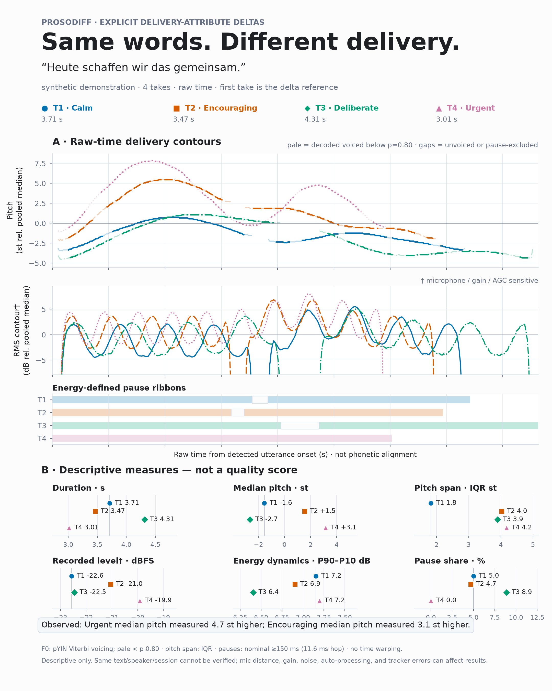
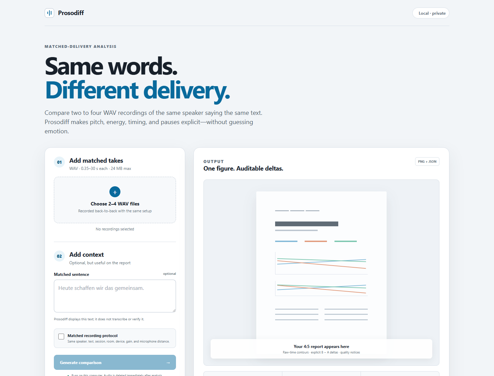

# Prosodiff

**Same words. Different delivery—made visible.**

Prosodiff is a small, training-free CLI for comparing two to four recordings of the same speaker saying the same text in different ways. It exports a publication-grade 4:5 figure and a versioned JSON record of explicit delivery-attribute deltas—without predicting emotions or collapsing the comparison into a single score.



Built as a side tool for retrieval-augmented expressive TTS research (ProsodyRAG) at Universität Osnabrück.

## What it reports

- utterance duration;
- median F0 and robust pitch span (interquartile range in semitones);
- recorded RMS level and within-take energy dynamics;
- energy-defined internal pause count, time, and share;
- pYIN coverage, clipping, level, pitch-boundary, and pause-sensitivity warnings;
- every unordered pair as an explicit **B − A** attribute delta.

Prosodiff does **not** infer emotion, speaking rate, linguistic boundaries, listener response, naturalness, vocal effort, or an overall prosody score.

## Local browser interface

Start the private, loopback-only interface:

```bash
uv run prosodiff ui
```

Prosodiff opens a browser page where you can select two to four WAV files, edit their labels, add the matched sentence, generate the same 4:5 card and JSON as the CLI, and download both outputs. The scientific analysis and schema are identical in both interfaces.



The server binds only to `127.0.0.1`; it has no telemetry, CDN assets, or external API calls. Uploaded recordings use random temporary filenames and are deleted immediately after the analysis succeeds or fails. Generated PNG/JSON results are deleted when the server stops. Do not modify the code to expose this development interface on `0.0.0.0` or deploy it publicly.

If a browser does not open automatically, copy the local URL printed in the terminal. Use `uv run prosodiff ui --no-open-browser --port 7860` when you want a fixed port.

## Fresh-clone quickstart

Requires Python 3.10+ and [uv](https://docs.astral.sh/uv/).

Install in one command:

```bash
uv sync --extra dev
```

Generate the complete synthetic demonstration in one command:

```bash
uv run prosodiff demo --output docs/prosodiff-card.png
```

The command creates `docs/prosodiff-card.png` and `docs/prosodiff-card.json`. No real audio is committed; the demo signals are deterministic synthetic fixtures and are labelled accordingly in the figure and JSON.

The first run can take roughly one to two minutes while librosa/Numba and Matplotlib build local caches; subsequent short-utterance runs are faster.

## Exact usage example

Record the same sentence back-to-back, then run:

```bash
uv run prosodiff compare calm.wav encouraging.wav --label Calm --label Encouraging --text "Heute schaffen wir das gemeinsam." --output prosodiff-card.png
```

This writes `prosodiff-card.png` plus the adjacent `prosodiff-card.json` explicit delivery-attribute delta schema. Pass two, three, or four WAV files; repeat `--label` once per file.

## Recording protocol

Recorded-level comparisons are only interpretable when every take uses:

1. the same speaker and exact text;
2. the same device, room, microphone direction, gain, and distance;
3. one back-to-back recording session;
4. disabled auto-gain, noise suppression, “voice enhancement,” and other automatic processing where possible;
5. unclipped, unnormalized PCM WAV files.

The tool cannot verify these assumptions. It records them in the JSON and keeps microphone-sensitive measures visibly marked in the figure.

## Method

Prosodiff resamples analysis copies to 22.05 kHz but never peak-normalizes, denoises, pre-emphasizes, repairs pitch, or time-warps audio.

- **Pitch:** `librosa.pyin`, 50–600 Hz by default, with frames retained only at voiced probability ≥0.80. Median F0 is compared on a take-balanced shared semitone reference. Pitch span is the IQR, reducing sensitivity to isolated extremes without silently deleting octave jumps.
- **Recorded energy:** time-domain RMS in dBFS. The absolute active-frame median is retained for between-take deltas; contour display is relative to the pooled take median. This is recorded level—not calibrated SPL, loudness, intensity, or vocal effort.
- **Energy-defined pauses:** an adaptive RMS threshold followed by removal of sub-50 ms energy islands and filling of sub-150 ms gaps. Internal gaps use a nominal 150 ms cutoff with one-hop (11.6 ms) boundary quantization. The detector repeats at ±3 dB and warns when the result changes materially.
- **Time:** contours use raw seconds from the detected utterance onset. They are explicitly not phonetic alignment. Normalized coordinates are stored in JSON only as a coarse linear-time view and must not be treated as phone correspondence.

All calculations are descriptive. A difference between two recordings is not evidence that listeners perceived a different intention.

## JSON contract

The machine-readable output uses schema `prosodiff.explicit-delivery-attribute-delta`, version `0.1.0`. It contains:

- fixed analysis parameters and assumptions;
- input metadata, utterance spans, pitch/energy/pause attributes, and quality warnings;
- auditable raw-time and normalized-time contours, with unavailable values encoded as JSON `null`;
- all unordered input pairs in order, always identified as `b_minus_a`;
- pair-level reliability fields and confound warnings.

The schema is intentionally multidimensional. There is no aggregate “expressivity” or quality score.

## Honest approximations

- pYIN probabilities are an engineering confidence signal, not calibrated certainty; tracker errors can remain.
- Energy measurements are dominated by recording chain changes if the protocol is not controlled.
- Energy-defined gaps are not syntactic, pragmatic, or linguistic pause labels.
- Same-speaker and same-text assumptions are supplied by the user and are not verified.
- Short-utterance acoustic deltas do not establish population effects or listener cognition.

## Development

Run the synthetic test suite:

```bash
uv run pytest
```

The tests generate audio inside temporary directories. No recordings or research datasets are stored in the repository.

## Roadmap

1. Add optional transcript-aware phone alignment while retaining raw-time views.
2. Add batch manifests for ProsodyRAG reference-versus-synthesis evaluation and Flowent tutor-voice QA.
3. Validate acoustic deltas against preregistered listener judgments rather than assuming perceptual relevance.

## Author and license

Created by **Abdalla Sera** ([asera-1](https://github.com/asera-1)). Released under the [MIT License](LICENSE).

Prosodiff’s authored source is MIT-licensed. Installed dependencies retain their own licenses; the locked librosa audio stack includes dynamically used or installed LGPL components such as `libsndfile` and `python-soxr`. They are not vendored or redistributed by this repository.
